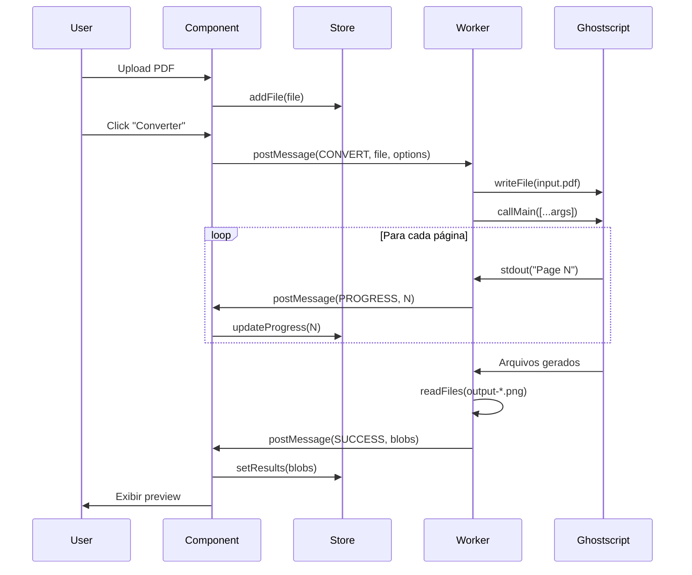

# 📐 Arquitetura do Sistema

## Diagrama de Alto Nível

```
┌──────────────────────────────────────────────────────────────────┐
│                        BROWSER                                    │
├──────────────────────────────────────────────────────────────────┤
│  ┌─────────────────┐    ┌─────────────────┐    ┌──────────────┐  │
│  │   Vue.js App    │    │   Web Worker    │    │   IndexedDB  │  │
│  │                 │◄──►│                 │◄──►│   (Cache)    │  │
│  │  - Components   │    │  - GS Module    │    │              │  │
│  │  - Composables  │    │  - MEMFS        │    │              │  │
│  │  - Pinia Store  │    │  - Processing   │    │              │  │
│  └─────────────────┘    └─────────────────┘    └──────────────┘  │
│           ▲                     ▲                                 │
│           │                     │                                 │
│           ▼                     ▼                                 │
│  ┌─────────────────┐    ┌─────────────────┐                      │
│  │   File System   │    │   gs.wasm       │                      │
│  │   API (Upload)  │    │   (~30-50MB)    │                      │
│  └─────────────────┘    └─────────────────┘                      │
└──────────────────────────────────────────────────────────────────┘
```

---

## Camadas da Aplicação

### 1. UI Layer (Vue Components)

```
src/components/
├── upload/
│   ├── FileUploader.vue      # Drag & drop de arquivos
│   ├── FileList.vue          # Lista de arquivos carregados
│   └── FilePreview.vue       # Thumbnail do PDF
├── conversion/
│   ├── ConversionPanel.vue   # Painel principal de conversão
│   ├── SettingsForm.vue      # Configurações (DPI, formato, etc)
│   └── ResultPreview.vue     # Preview do resultado
├── manipulation/
│   ├── PageSelector.vue      # Seleção visual de páginas
│   ├── MergePanel.vue        # Interface de merge
│   └── SplitPanel.vue        # Interface de split
├── analysis/
│   ├── DocumentInfo.vue      # Informações do documento
│   └── TextExtractor.vue     # Extração de texto
└── common/
    ├── ProgressBar.vue       # Barra de progresso
    ├── ErrorAlert.vue        # Exibição de erros
    └── DownloadButton.vue    # Botão de download
```

### 2. State Layer (Pinia)

```
src/stores/
├── pdfStore.ts               # Estado dos PDFs carregados
│   - files: File[]
│   - currentFile: File | null
│   - pageCount: number
│   - metadata: PdfMetadata
│
├── conversionStore.ts        # Estado das conversões
│   - isProcessing: boolean
│   - progress: number
│   - results: ConversionResult[]
│   - error: string | null
│
└── settingsStore.ts          # Configurações do usuário
    - resolution: number
    - format: 'png' | 'jpeg'
    - quality: number
    - theme: 'light' | 'dark'
```

### 3. Service Layer (Composables)

```
src/composables/
├── useGhostscript.ts         # Interface com o worker
│   - init(): Promise<void>
│   - convertToImage(options): Promise<Blob[]>
│   - compressPdf(options): Promise<Blob>
│   - extractPages(range): Promise<Blob>
│
├── useFileSystem.ts          # Gerenciamento de arquivos
│   - readFile(file): Promise<ArrayBuffer>
│   - downloadBlob(blob, filename): void
│   - createZip(files): Promise<Blob>
│
├── usePdfAnalysis.ts         # Análise de PDFs
│   - getPageCount(buffer): Promise<number>
│   - getMetadata(buffer): Promise<Metadata>
│   - extractText(buffer): Promise<string>
│
└── useProgress.ts            # Sistema de progresso
    - progress: Ref<number>
    - status: Ref<string>
    - startTracking(): void
    - stopTracking(): void
```

### 4. Worker Layer

```
src/workers/
└── ghostscript.worker.ts

    Mensagens:
    ┌────────────────────────────────────────┐
    │ INIT         → { }                     │
    │ CONVERT      → { file, options }       │
    │ COMPRESS     → { file, preset }        │
    │ EXTRACT      → { file, range }         │
    │ MERGE        → { files }               │
    │ ANALYZE      → { file }                │
    └────────────────────────────────────────┘

    Respostas:
    ┌────────────────────────────────────────┐
    │ READY        ← { }                     │
    │ PROGRESS     ← { percent, page }       │
    │ SUCCESS      ← { result }              │
    │ ERROR        ← { message, code }       │
    └────────────────────────────────────────┘
```

---

## Fluxo de Dados

### Conversão PDF → Imagem



---

## Tipos TypeScript

```typescript
// types/ghostscript.ts

interface ConvertOptions {
  device: "png16m" | "jpeg" | "pnggray";
  resolution: 72 | 150 | 300 | 600;
  quality?: number; // 1-100, apenas JPEG
  antialiasing: 1 | 2 | 4;
  pages?: PageRange;
}

interface CompressOptions {
  preset: "screen" | "ebook" | "printer" | "prepress";
  compatibilityLevel?: "1.4" | "1.5" | "1.6" | "1.7";
}

interface PageRange {
  type: "all" | "range" | "custom";
  start?: number;
  end?: number;
  custom?: number[];
}

interface ConversionResult {
  id: string;
  filename: string;
  blob: Blob;
  pageNumber?: number;
  timestamp: Date;
}

interface PdfMetadata {
  title?: string;
  author?: string;
  subject?: string;
  keywords?: string[];
  creationDate?: Date;
  modificationDate?: Date;
  pageCount: number;
  fileSize: number;
}

interface WorkerMessage {
  type: "INIT" | "CONVERT" | "COMPRESS" | "EXTRACT" | "MERGE" | "ANALYZE";
  id: string;
  payload?: any;
}

interface WorkerResponse {
  type: "READY" | "PROGRESS" | "SUCCESS" | "ERROR";
  id: string;
  progress?: number;
  result?: any;
  error?: { message: string; code: string };
}
```

---

## Decisões de Design

| Decisão              | Alternativas                   | Escolha    | Justificativa                      |
| -------------------- | ------------------------------ | ---------- | ---------------------------------- |
| State management     | Vuex, Pinia, Composables       | Pinia      | API moderna, TypeScript nativo     |
| Worker communication | Raw postMessage, Comlink       | Raw        | Menos dependências, controle total |
| Styling              | Tailwind, CSS Modules, Vanilla | A definir  | -                                  |
| Router               | Vue Router                     | Vue Router | Padrão do ecossistema              |
| Build                | Vite, Webpack                  | Vite       | Mais rápido, ESM nativo            |
